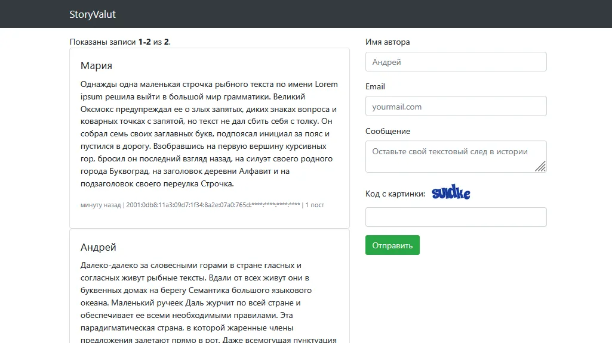

# ТЗ на выполнение

## Описание

Создать приложение “StoryValut”, в котором любой может оставить своё сообщение. Оригинал силит [тут](https://ag-hello.notion.site/StoryValut-Yii2-31bd571811ab4512849bdf3db727f519)



## Требование к приложению

1. Фреймворк: Yii2, рекомендуется шаблон “basic”.
2. Все лишние Yii2 Basic страницы по-умолчанию вроде “About”, “Contact” должны быть удалены
3. Относитесь к проекту так, будто это реальный коммерческий продукт:
    1. понятный и логично структурированный код;
    2. внимание к безопасности;
    3. поддерживаемость и простота дальнейшего развития проекта;
    4. документирование;
4. Разрешено использовать сторонние библиотеки, возможности фреймворка для решения задач.

## Требования к отправке постов

1.  Ограничения символов:
    - Имя автора: минимум 2 символа, максимум 15.
    - Сообщение: минимум 5 символов, максимум 1000.
1.  Валидный e-mail
1.  Каптча/Рекаптча
1.  IP автора должен записываться
1.  Дата публикации должна записываться в unixtime
1.  Запрещены сообщения, состоящие исключительно из пробелов
1.  Разрешать отправлять автору только 1 сообщение в 3 минуты. При попытке отправить ранее, чем через 3 минуты — выводить ошибку, в которой указано когда может быть опубликовано следующее сообщение


## Требования к выводу постов

1.  Посты должны выводится в формате Bootstrap Card
    <br>ℹ️ Готовая разметка

        ```
        <div class="card card-default">
            <div class="card-body">
                <h5 class="card-title">{{author}}</h5>
                <p>{{message}}</p>
                <p>
                    <small class="text-muted">
                        {{createdAtRelative}} |
                                        {{ip}} |
                                        {{postsCount, plural, =0{нет постов} one{# пост} few{# поста} many{# постов} other{# поста}}}
                    </small>
                </p>
            </div>
        </div>
        ```

1.  Выводить общее число сообщений автора (на основе IP-адреса)
1.  Разрешать использовать в сообщении только HTML-тэги: `<b>`, `<i>`, `<s>`
1.  Дата публикации выводится в формате “Relative time” (Пример: “*10 минут назад*”)
1.  Полузакрытый IP адрес:
    - Для IPv4: 2 последних разряда (октета) должны быть скрыты. Пример: `46.211.**.**`
    - Для IPv6 адреса — скрывать 4 последних секции адреса IPv6. Пример: `2001:0db8:11a3:09d7:1f34:8a2e:07a0:765d:****:****:****:****`


## Управление постами

1.  После отправки поста, отправлять автору на e-mail письмо, в котором идут приватные ссылки на управление его постом:
    - Редактирование поста
    - Удаление поста

    <aside>
    ℹ️

    Реальную отправку настраивать **не** нужно. Результат будет проверяться в отладочном режиме отправки почты Yii2.

    </aside>

1.  Редактирование доступно в течение 12 часов после отправки. Редактируется только само сообщение. Применяются те же правила валидации, что и при отправке.
1.  Удаление поста доступно в течение 14 дней с момента публикации. Физическое удаление из базы данных не происходит (soft-deleted). Подтверждение удаления выполняется на отдельной странице, где пользователь должен явно подтвердить действие.